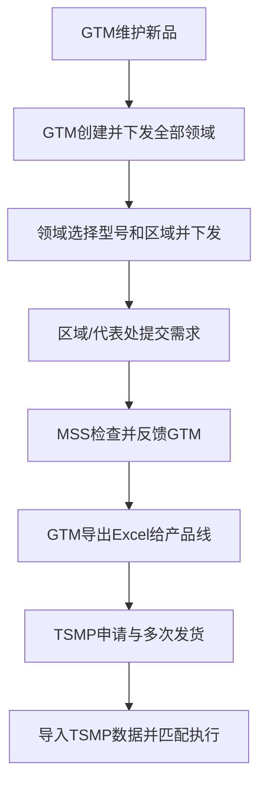
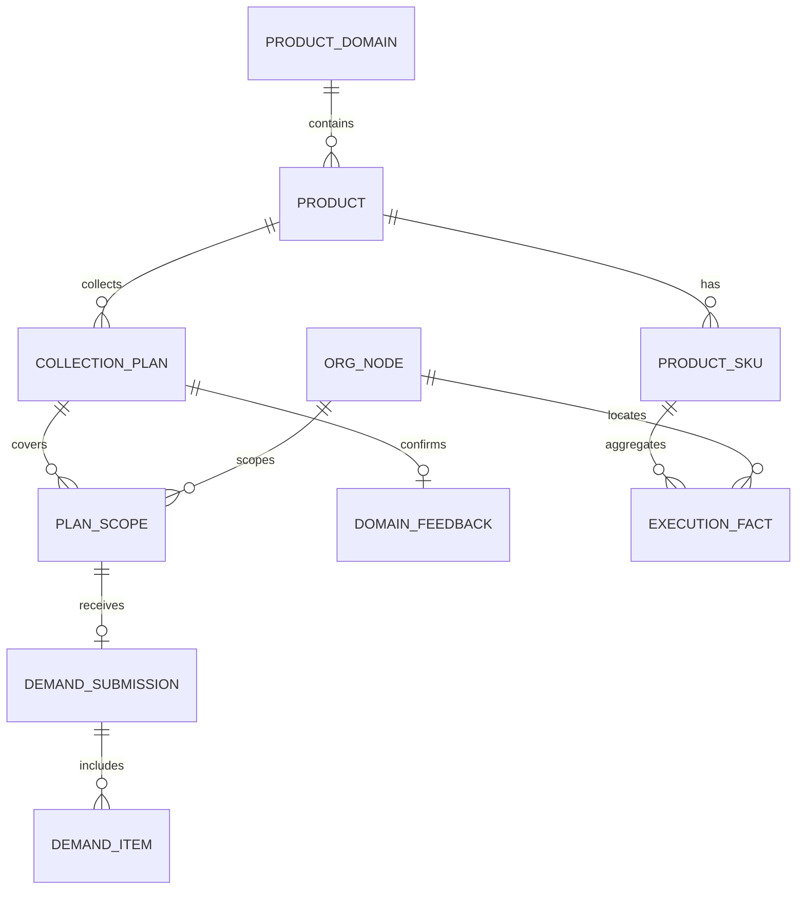

# MSS样机备货管理平台 PRD v1.0

> 面向豆包 Vibe Coding 的实施规格。本文与当前高保真原型、`AGENTS.md` 和 `qa/final-*.png` 共同构成实现基线；当文字与高保真发生冲突时，以“业务规则以本文为准、布局与视觉以高保真为准”为原则处理。

## 0. 文档信息

| 项目 | 内容 |
| --- | --- |
| 产品名称 | MSS样机备货管理平台 |
| 文档版本 | v1.0 |
| 适用终端 | PC Web，设计基准宽度 1440px，最低支持 1280px |
| 本期范围 | 总体框架、需求收集、执行情况、基础配置 |
| 关联但不展开 | 发货审批、库存核对、提醒中心、数据明细 |
| 数据来源 | 平台需求数据、产品/组织主数据、TSMP导出发货数据、库存只读汇总 |
| 数量单位 | Pcs |
| 主要语言 | 简体中文 |

### 0.1 高保真基线

开发时必须逐屏对照以下文件：

| 页面 | 基线文件 |
| --- | --- |
| GTM计划管理 | `qa/final-01-gtm-plan.png` |
| MSS领域任务 | `qa/final-02-mss-tasks.png` |
| 领域反馈GTM | `qa/final-03-domain-feedback.png` |
| 区域需求填报 | `qa/final-04-region-entry.png` |
| 运营总览 | `qa/overview-final.jpg` |
| 执行情况 | `qa/tsmp-execution-final.jpg`、`qa/execution-tracking-simplified-final.jpg` |
| 基础配置 | `qa/demand-responsibility-final.jpg`、`qa/domain-responsibility-final.jpg`、`qa/organization-config-final.jpg` |

不得擅自更换导航结构、页面层级、主色、表格密度、卡片样式、字段名称、角色动作或状态文案。

## 1. 产品背景与目标

新品项目启动后，产品线需要MSS反馈样机需求以安排排产。当前主要依赖Excel逐层收集，存在以下问题：

1. 产品、SKU、BOM、领域责任人和组织口径分散，BOM未就绪时容易阻塞收集。
2. GTM、MSS领域接口人、区域/代表处接口人的动作混在同一张表里，责任边界不清。
3. 需求完成后缺少“领域正式反馈GTM”的交接节点，GTM难以判断是否可导出排产。
4. 实际申请和发货发生在TSMP，且可能多次申请、多次发货，无法用单一状态反映执行进度。
5. TSMP导出的发货数据需要按照业务领域、地区部、代表处、国家/地区、BOM编码与已确认需求匹配。

### 1.1 产品目标

- 用一条可追溯流程贯通“新品建档—计划下发—区域收集—领域反馈—GTM导出—TSMP执行匹配”。
- 在SKU/BOM尚未完全就绪时允许先按产品级收集，后续补充主数据后不丢失历史需求。
- 根据角色提供独立工作台，避免跨角色操作和状态误解。
- 默认按产品汇总查看执行，展开到SKU，并下钻到区域、代表处、国家/地区。
- 用累计申请、累计发货和剩余缺口表达多次申请、多次发货，不创建碎片化发货记录卡片。
- 所有页面复用同一产品领域、责任人、区域—代表处—国家组织树。

### 1.2 非目标

- 不替代TSMP完成申请、审批、发货或库存记账。
- 不在本期建设逐批发货明细管理、物流轨迹或仓库WMS能力。
- 不把“状态+操作”设计成执行情况主表的核心；执行页面是跟踪分析页，不是处理队列。
- 不把多个产品合并成一个固定Chitu项目；多产品是基础能力。
- 不要求新品建档时必须具备SKU或BOM。

## 2. 用户角色与权限

| 角色 | 数据范围 | 核心职责 | 允许的关键动作 |
| --- | --- | --- | --- |
| GTM | 自己负责的产品领域及其产品 | 新品建档、创建/下发计划、查看收集进度、接收领域反馈、导出排产 | 新增/编辑产品；新建/下发计划；查看领域反馈；导出Excel |
| MSS领域接口人 | 自己负责的产品领域 | 接收GTM计划、组织区域收集、检查领域汇总、正式反馈GTM | 查看领域任务；进入区域收集；查看汇总；提交领域汇总给GTM |
| 区域/代表处接口人 | 被授权的区域或代表处 | 汇总代表处/国家需求并提交区域结果 | 保存草稿；Excel粘贴；提交至领域接口人 |
| 备货接口人 | 自己负责领域的已确认需求及TSMP执行数据 | 查看申请/发货执行、识别待申请/待发缺口 | 导入TSMP数据；筛选下钻；导出匹配明细 |

权限原则：

- 页面路由和服务端接口都必须校验角色及数据范围，前端隐藏按钮不能替代后端鉴权。
- GTM不能在计划管理页看到“查看填报”“模拟收齐”等MSS/区域动作。
- MSS领域接口人不能创建GTM收集计划。
- 区域/代表处接口人只能编辑授权范围内的草稿；提交后默认只读，如需修改由领域接口人退回或代录。
- 高保真演示环境中的角色切换器仅用于验收，生产环境应由SSO身份与授权范围自动决定。

## 3. 核心术语

| 术语 | 定义 |
| --- | --- |
| 产品领域 | 产品类型责任单元，例如穿戴、手机、平板；领域配置GTM和领域备货接口人 |
| 产品 | 一次新品项目或系列，例如Chitu B19系列 |
| SKU/产品型号 | 产品下的可执行型号，可一对多 |
| BOM编码 | SKU对应编码，可在收集启动后补充 |
| 收集计划 | GTM针对“产品+样机阶段”发起的一轮需求收集，下发后所有启用的MSS领域都会收到领域任务 |
| 领域任务 | GTM计划在某个MSS业务领域下的任务副本；领域接口人选择部分或全部型号及区域后二次下发 |
| 区域提交 | 区域/代表处接口人将本区域需求提交给MSS领域接口人 |
| 领域反馈 | MSS领域接口人确认区域全部收齐后，将领域汇总正式交接给GTM |
| 确认需求 | GTM接收领域反馈后用于排产与执行核对的需求数量 |
| 累计申请 | TSMP内同一产品/SKU/组织范围的申请数量累计 |
| 累计发货 | TSMP导出数据成功匹配后的发货数量累计 |

## 4. 总体业务流程

### 4.1 GTM收集计划状态机

| 状态 | 进入条件 | 允许动作 | 下一状态 |
| --- | --- | --- | --- |
| 产品建档 | 产品已创建，但计划信息未完整 | GTM完善产品/计划 | 待下发 |
| 待下发 | 计划已创建，产品、阶段和截止时间已确认 | GTM下发给所有启用MSS领域 | 收集中 |
| 收集中 | 至少一个领域未完成反馈 | 领域下发区域；区域填报；MSS跟进/代录/反馈 | 待GTM收口 |
| 待GTM收口 | 所有领域均已正式反馈GTM | GTM查看反馈、导出排产 | 已导出 |
| 已导出 | GTM已生成排产文件 | GTM重新导出；查看历史 | 已导出 |

领域任务独立状态为：`待下发区域 → 区域收集中 → 待反馈GTM → 已反馈GTM`。已有任一区域开始填报后，不允许修改该领域任务的型号或区域范围。所有状态变更记录操作者、时间、前后状态和备注。

## 5. 总体框架 PRD

### 5.1 信息架构

左侧主导航固定为：

1. 运营总览
2. 需求收集
3. 发货审批
4. 执行情况
5. 库存核对
6. 提醒中心
7. 数据明细
8. 配置管理

本期必须完整实现第1、2、4、8项；其他导航保留高保真入口和可扩展路由，不得从整体框架删除。

### 5.2 全局布局

| 区域 | 规格 |
| --- | --- |
| 顶栏 | 高72px；左侧品牌“MSS样机备货管理平台”；右侧角色演示切换、区域演示切换、通知、头像和姓名 |
| 侧栏 | 宽220px；白底；图标+文字；当前项使用浅蓝底和MSS蓝文字 |
| 内容区 | 背景`#F7F9FC`；主内容与侧栏、顶栏之间无重叠；1280px下允许表格区域内部滚动，不允许页面级横向滚动 |
| 页面标题 | 标题+一句用途说明；右侧放本页主操作或产品筛选 |
| KPI条 | 4—5项并列，使用分隔线，不做重阴影装饰卡片 |
| 内容面板 | 白底、浅灰边框、圆角；标题、说明、工具栏、表格层级固定 |

### 5.3 视觉与交互规范

- 主色为MSS蓝白体系；页面背景`#F7F9FC`，主按钮深蓝，选中态浅蓝。
- 完成态用克制的绿色；待完善、差异、未匹配用琥珀色；不使用惩罚感红色。
- 禁止渐变、装饰性插画、科技大屏背景和无业务价值图表。
- 表格为高密度办公表格；主字段加粗，辅助信息置于同单元格小字。
- 主操作使用实心蓝按钮，次操作描边或文字按钮。
- 所有异步操作提供loading、防重复提交、成功/失败Toast。
- 空态必须说明“为什么为空”和“下一步做什么”；错误态保留筛选条件和已输入内容。
- 数量统一显示千分位，输入时仅允许0及以上整数；日期统一使用业务时区。
- 搜索默认覆盖产品名、SKU、BOM、计划编号和责任人中与页面相关的字段。

### 5.4 全局产品与组织筛选

- 多产品是全平台默认能力；总览、执行情况支持“全部产品”和单产品。
- 组织选择依次为区域→代表处→国家/地区；下级选项依赖上级，改变上级时清空无效下级值。
- 切换筛选后，KPI、表格、提示语、导出范围必须同步变化，不能仅更新表格。

### 5.5 通用页面状态

| 状态 | 要求 |
| --- | --- |
| 首次加载 | 展示骨架屏，避免空白闪烁 |
| 无数据 | 展示空态说明，不显示全0的误导性进度 |
| 部分失败 | 页面主体保留，失败区域支持重试 |
| 无权限 | 403页面说明当前角色和所需角色，不暴露敏感数据 |
| 并发冲突 | 使用版本号或`updated_at`校验，提示“数据已被他人更新”，刷新后重试 |
| 导入处理中 | 展示文件名、上传时间、总行数、已处理数和状态 |

## 6. 需求收集 PRD

### 6.1 页面清单

| 编号 | 页面 | 角色 | 高保真标题 |
| --- | --- | --- | --- |
| DC-01 | GTM计划管理 | GTM | 需求收集 · 计划管理 |
| DC-02 | 新建收集计划弹窗 | GTM | 新建需求收集计划 |
| DC-03 | MSS领域任务列表与二次下发 | MSS领域接口人 | 需求收集 · 我的领域任务 |
| DC-04 | 收集任务详情 | GTM只读/MSS可操作 | 产品名需求收集 |
| DC-05 | 区域任务列表 | 区域/代表处接口人 | 需求收集 · 我的区域填报 |
| DC-06 | 区域需求填报 | 区域/代表处接口人/MSS代录 | 产品名 · 区域需求填报 |

### 6.2 DC-01 GTM计划管理

目标：让GTM只管理新品收集计划的创建、下发、进度、领域反馈和导出。

KPI：

| 指标 | 计算口径 |
| --- | --- |
| 进行中计划 | 状态为收集中、待领域反馈、待GTM收口的计划数 |
| 待领域反馈 | 已下发领域任务数减已反馈领域任务数 |
| 已收集需求 | 当前筛选范围内已形成的需求数量合计 |
| BOM待补充 | 启用产品中无SKU或至少一个SKU无BOM的产品数 |
| 覆盖组织 | 启用区域数及代表处合计 |

计划表字段：计划/产品、MSS领域任务、区域收集进度、需求汇总、BOM准备度、当前节点、截止时间、GTM操作。

GTM操作规则：

- 产品建档：显示“完善产品”。
- 待下发：显示“下发全部领域”。
- 收集中/待领域反馈：显示“查看收集进度”。
- 待GTM收口：显示“查看领域反馈”“导出排产”。
- 已导出：显示“查看领域反馈”“重新导出”。
- 永远不显示“查看填报”“模拟收齐”。

### 6.3 DC-02 新建收集计划

| 字段 | 类型 | 必填 | 规则 |
| --- | --- | --- | --- |
| 新品项目 | 单选 | 是 | 仅展示启用产品；显示“领域｜产品名” |
| 样机阶段 | 单选 | 是 | 从基础数据中的样机阶段字典取值；阶段属于本次收集计划，不写入产品主数据 |
| 收集截止时间 | 日期时间 | 是 | 必须晚于当前时间 |
| 计划说明 | 文本 | 否 | 最多500字 |

创建后状态为“待下发”。GTM点击下发后，系统按所有启用的MSS业务领域生成领域任务，GTM无需逐一选择领域。若产品仅有名称、暂无SKU/BOM，允许创建和下发；页面提示“BOM可后补，不影响先发起收集”。同一“产品+样机阶段”只能有一条未结束计划。

### 6.4 DC-03 MSS领域任务列表

目标：领域接口人只看到自己领域内的任务，并在区域开始填报前完成二次下发。

页面顶部明确显示“领域名 · 接口人”。流程条为：接收GTM计划→选择范围并下发→检查领域汇总→反馈给GTM。

列表字段：计划/产品、本领域、已选型号/区域、区域进度、领域需求、任务状态、下一步。

下一步文案：

- 待下发区域：配置并下发。
- 区域收集中：跟进收集；没有区域开始填报时可调整范围。
- 待反馈GTM：检查并反馈。
- 已反馈GTM：查看已反馈。

二次下发弹窗规则：

- 产品型号取GTM计划所选产品下的启用SKU，支持选择部分或全部；若产品暂时没有SKU，则允许按产品级条目下发。
- 区域取启用的区域配置，支持多选或全部选择，至少选择一个区域。
- 下发后每个选中区域只收到当前MSS领域的一条任务，并仅能填报本次选中的型号。
- 同一产品、区域在不同MSS领域下的数据按领域任务ID隔离，不得互相覆盖或串数。
- 任一区域草稿状态不再是`NOT_STARTED`后，型号和区域范围锁定；如需调整，须先处理已有草稿。

本页不得出现“新建计划”。

### 6.5 DC-04 收集任务详情

固定包含三个页签：区域收集进度、领域需求汇总、反馈GTM/领域反馈。

#### A. 区域收集进度

字段：MKT区域、区域接口人、代表处/国家数量、区域需求、提交状态、领域操作/查看。

提交状态：未开始、填报中、已提交。状态来源于区域提交对象，不允许根据需求数量猜测“已提交”。GTM进入时只读；MSS可进入未提交区域代录或调整。

#### B. 领域需求汇总

- 默认显示产品汇总行，向下展示SKU行。
- 列为：产品/SKU、BOM编码、各区域数量、领域合计。
- SKU/BOM缺失时显示“产品名（型号待补充）”和“待补充”。
- 所有合计由服务端返回或使用同一计算函数生成，严禁页面各自计算出不同数字。
- 区域未提交时，其已有草稿数量可以展示，但必须明确标识“未提交，不纳入确认需求”。

#### C. 反馈GTM

MSS端展示：产品、区域完成数、领域总需求、BOM准备度、反馈说明、确认勾选、检查清单和主按钮“提交领域汇总给GTM”。

提交前置条件：

1. 计划范围内全部区域均已提交。
2. 需求数量均为非负整数。
3. 所有数量大于0的行已填写需求依据。
4. 用户勾选确认语句。
5. 当前用户是该领域接口人。

提交后计划进入“待GTM收口”，保存反馈人、反馈时间、反馈说明、汇总快照和版本号。GTM端显示同一内容但只读。

### 6.6 DC-05 区域任务列表

- 仅展示当前用户有权限的区域/代表处任务。
- KPI：待填报任务、已提交任务、区域代表处数、国家/地区数、当前区域。
- 每条任务显示产品、GTM/MSS下发信息、覆盖组织、截止时间、当前状态和“进入填报/查看已提交”。
- 已提交任务默认只读；若被MSS退回，则恢复可编辑并展示退回原因。

### 6.7 DC-06 区域需求填报

布局与`qa/final-04-region-entry.png`一致：标题与批次元数据、产品切换、区域页签、Excel式表格、右侧提交前检查、底部固定操作栏。

表格字段：

| 字段 | 必填 | 规则 |
| --- | --- | --- |
| SKU | 系统带入 | 产品无SKU时生成一条产品级临时行 |
| BOM编码 | 否 | 无BOM显示“待产品线补充” |
| 需求数量(Pcs) | 是 | 0及以上整数；提交时计划内每个产品项必须明确填写，允许0 |
| 需求依据 | 条件必填 | 数量>0时必填；枚举：新品上市体验、重点客户PoC、零售门店评测、渠道体验、其他 |
| 计划使用时间 | 否 | `YYYY-MM-DD`；建议不晚于计划使用窗口 |
| 备注 | 否 | 最多500字 |

交互规则：

- 自动保存：输入停止2秒后保存草稿；底部显示最近保存时间。
- 手工保存：点击“保存草稿”立即保存，不改变提交状态。
- Excel粘贴：按照当前产品项顺序解析Tab、空格或逗号分隔数量；数量个数不匹配时不写入并提示。
- 下载模板：导出当前产品、当前区域的CSV/XLSX模板；产品项顺序与页面一致。
- 提交：按钮文案固定为“提交至领域接口人”；MSS代录时为“将区域纳入领域汇总”。
- 提交成功后更新区域状态和MSS任务进度，不直接反馈GTM。
- 表单错误定位到第一处错误；用户已输入内容不得丢失。

### 6.8 GTM排产导出

导出仅允许“待GTM收口/已导出”状态。文件至少包含：计划编号、产品、产品领域、SKU/产品项、BOM编码、MSS区域、代表处、国家/地区、确认需求数量、需求依据、计划使用时间、备注、领域反馈人、反馈时间。

导出后保存文件名、导出人、导出时间、计划版本和数据快照。重新导出不能覆盖历史审计记录。

## 7. 执行情况 PRD

### 7.1 定位与数据源

执行情况用于比较已确认需求、TSMP累计申请、TSMP累计发货和当前可用库存。申请/发货并非一次性完成，因此页面不使用单一“已完成/未完成”状态，也不提供逐行处理操作。

数据来源：

- 确认需求：领域已正式反馈且GTM已收口的需求快照。
- 累计申请：TSMP申请数据或Bookmarklet查询服务沉淀的累计结果。
- 累计发货：TSMP导出的发货Excel，经匹配后累计。
- 可用库存：库存核对模块提供的只读聚合值。

### 7.2 TSMP数据导入与匹配

页面顶部必须保留“TSMP发货数据匹配”面板，显示最近导入文件、时间、总行数、自动匹配数、待维护映射数、未匹配数。

Excel字段对应关系：

| TSMP Excel字段 | 平台标准字段 |
| --- | --- |
| 业务领域 | MSS领域 |
| 地区部 | 区域 |
| 代表处 | 代表处 |
| 国家/地区 | 国家 |
| BOM编码 | 产品BOM编码 |
| 发货数量 | 实际发货数量 |

自动匹配使用“MSS领域+BOM编码+区域+代表处+国家”组合口径。业务领域支持按MSS领域名称或编码标准化；BOM编码用于定位产品型号；地区部、代表处、国家必须满足组织树父子关系。确认需求暂未细分到国家时，允许同一代表处下的有效国家匹配该代表处需求。

导入过程：上传→表头校验→字段映射→数据标准化→重复检测→自动匹配→统计结果→写入累计执行数据。

必需导入字段：业务领域、地区部、代表处、国家/地区、BOM编码、发货数量；可选字段：发货日期、TSMP申请单号、数据唯一键。

去重规则：使用`数据唯一键+申请单号+业务领域+BOM编码+地区部+代表处+国家/地区+发货日期+发货数量`生成指纹。重复行不得重复累计。

异常分类：

- 待维护映射：原始值可识别类型，但未命中主数据别名。
- 未匹配：缺少关键字段或无法关联任何已确认需求。
- 重复数据：已导入过，不参与累计。
- 数量异常：发货数量非正整数或超出业务允许范围。

### 7.3 页面筛选

筛选顺序：区域→代表处→国家/地区；另有产品筛选和产品/SKU/BOM关键词搜索。

- 默认范围为全球MSS、全部产品。
- 区域改变后清空代表处和国家；代表处改变后清空国家。
- 所有KPI、表格、范围标签和导出均使用同一筛选条件。

### 7.4 KPI及公式

| 指标 | 公式 |
| --- | --- |
| 确认需求 | `SUM(confirmed_demand_qty)` |
| 累计申请 | `SUM(applied_qty)` |
| 累计发货 | `SUM(shipped_qty)` |
| 剩余待申请 | `MAX(确认需求-累计申请, 0)`，超申请单独保留差额供提醒使用 |
| 剩余待发 | `MAX(累计申请-累计发货, 0)` |
| 需求申请率 | `累计申请/确认需求`；确认需求为0时显示“—” |
| 申请发货率 | `累计发货/累计申请`；累计申请为0时显示“—” |
| 发货批次 | 匹配成功且去重后的批次/文件内业务批次数 |

### 7.5 产品执行跟踪表

默认一行一个产品，点击产品行展开SKU。字段固定为：

1. 产品/SKU
2. 确认需求
3. 累计申请
4. 累计发货
5. 剩余待申请
6. 剩余待发
7. 可用库存
8. 申请/发货进度
9. 发货批次

产品行辅助信息展示产品领域、GTM、备货接口人和SKU数量。执行数据可能汇总同一产品的多个收集阶段，因此不在产品汇总行展示单一阶段。SKU行展示BOM。进度单元格使用“申/发”双进度条。

强制约束：

- 不增加“状态”列。
- 不增加“操作”列。
- 不展示零散的发货记录卡片或时间线。
- “发货批次”仅展示累计批次数，不下钻批次明细。
- 允许累计申请超过确认需求、累计发货超过累计申请，异常值不能被前端截断；KPI中的剩余值可归零，同时保留超出量供后续提醒。

### 7.6 导出匹配明细

导出必须继承当前全部筛选条件，包含原始TSMP字段、标准化字段、匹配到的产品/SKU/区域/代表处、匹配状态、未匹配原因、确认需求、累计申请和累计发货。导出文件名包含范围和时间。

## 8. 基础配置 PRD

### 8.1 页面结构

页面标题为“配置管理”，包含产品配置、产品品类、MSS业务领域、基础数据、用户管理（有权限时）和区域与代表处页签。各页签共用搜索、启停状态、表格视觉和新增/编辑弹窗；维护数据后必须保留当前页签，不得自动跳回产品配置。

### 8.2 产品配置

字段：

| 字段 | 必填 | 说明 |
| --- | --- | --- |
| 产品名称 | 是 | 新品立项时的最小必填字段之一 |
| 所属产品品类 | 是 | 决定继承的GTM和领域备货接口人 |
| 预计样机提供时间 | 否 | 可填“待产品线确认” |
| 计划默认截止 | 否 | 新建计划时作为默认值，可覆盖 |
| SKU/产品型号 | 否 | 一对多，可后补 |
| BOM编码 | 否 | 与SKU关联，可后补 |
| 启用状态 | 是 | 停用产品不允许新建计划，但保留历史数据 |

产品不保存样机阶段、MSS业务领域或默认收集范围，也不直接保存GTM和备货接口人姓名。样机阶段在新建收集计划时选择；MSS业务领域由GTM下发时自动覆盖全部启用领域，型号和区域范围由各领域接口人在二次下发时选择。责任人由页面通过所属产品品类或MSS领域实时解析。修改责任人后，产品配置、需求收集、执行情况中的责任人必须同步更新。

SKU补录时的数据迁移：若历史需求使用产品级临时行，系统提示GTM选择“按比例拆分、手工拆分、保留产品级行”。默认不自动拆分，避免数量错误。

### 8.3 领域与责任人

字段：领域名称、领域说明、GTM接口人、领域备货接口人、关联产品数、启用状态。

规则：

- 领域名称唯一。
- 同一领域当前只配置一名主GTM和一名主领域备货接口人；数据结构允许未来扩展代理人。
- 停用前若存在启用产品或进行中计划，必须阻止并提示处理关联项。
- 修改责任人立即影响新任务路由；进行中任务保留原接收人快照，同时给新责任人补充可见权限并记录变更。

### 8.4 区域与代表处

组织树固定为区域→代表处→国家/地区：

- 区域字段：名称、区域接口人、启用状态。
- 代表处字段：名称、代表处接口人、所属区域、启用状态。
- 国家/地区字段：名称、标准代码、所属代表处、启用状态。

规则：

- 同级名称唯一，组织编码全局唯一。
- 国家/地区只能属于一个启用代表处；跨组织调整必须记录生效时间。

### 8.5 用户负责范围

- 新建GTM或备货接口人时，必须从已启用的产品品类中选择至少一项负责范围，支持多选。
- 新建MSS领域接口人或区域/代表处接口人时，必须从已启用的MSS业务领域中选择至少一项负责范围，支持多选。
- 新建区域/代表处接口人时，还必须从“区域与代表处”组织配置中选择至少一个负责区域或代表处，支持多选；选择区域表示负责该区域下全部代表处，选择代表处表示仅负责该代表处及其下属国家/地区。
- 系统管理员不展示负责范围选择。
- 用户列表分别展示产品/MSS范围和区域/代表处范围；创建或调整责任人后，产品品类、MSS领域、组织节点负责人及角色数据权限同步生效。
- 进行中计划的范围使用计划快照，不因组织调整自动增减；新计划使用最新组织树。
- 停用组织后历史需求和执行数据仍可查询，默认筛选中不再出现。
- TSMP原始组织名称允许维护别名映射到标准组织节点。

## 9. 运营总览 PRD

### 9.1 定位

运营总览聚合展示多产品的需求、排产、申请、发货和库存信号，默认全产品，可切换单产品。页面重点是库存情况和执行情况，不做无关装饰图表。

### 9.2 KPI

| KPI | 口径 |
| --- | --- |
| 已确认需求 | GTM已收口的需求数量 |
| 产品线已排产 | 产品线反馈的排产数量；当前可由导入/接口提供 |
| TSMP已申请 | TSMP累计申请数量 |
| TSMP累计发货 | 成功匹配的累计发货数量及批次数 |
| 当前可用库存 | 库存模块返回的可用库存汇总 |

### 9.3 新品备货全流程

固定节点：新品建档、需求收集、产品线排产、TSMP发货、执行匹配。每个节点展示数量/项目数与完成/当前/待处理视觉状态。状态只用于流程概览，不替代执行数量。

### 9.4 产品执行情况

- 全部产品时：一行一个产品。
- 选择单产品时：一行一个SKU。
- 字段：产品/SKU、需求、已备货、已申请、可用库存、执行进度、状态。
- 状态仅用于总览提示，可用“待推进、需关注、执行中”；执行情况明细页不复用该状态列。

### 9.5 库存匹配与需关注

库存覆盖率：`可用库存 / MAX(累计申请-累计发货, 1)`，上限100%。展示前4个产品或SKU。

需关注至少包含：尚未申请需求数量、库存差异数量。点击分别进入执行情况和库存核对，并携带当前产品筛选。

## 10. 数据模型

核心实体及关系：

详细DDL见`db/schema.sql`。所有业务表必须包含`id`、`created_at`、`updated_at`和用于审计/并发控制的版本字段；业务状态使用稳定英文枚举，中文仅用于展示。

## 11. API与数据契约

接口前缀：`/api/v1`；完整契约见`docs/openapi.yaml`。

### 11.1 通用约定

- 请求头：`Authorization`（生产SSO令牌）、`X-Request-Id`、`If-Match`或版本号。
- 演示骨架使用`X-Role`模拟角色，仅用于本地开发。
- 成功响应：`{ code, message, data, requestId }`。
- 失败响应：`{ code, message, details, requestId }`。
- 列表接口支持`page`、`pageSize`、`keyword`和与页面一致的筛选条件。
- 所有数量字段为整数；所有时间为ISO 8601并带时区。

### 11.2 必需接口

| 模块 | 方法与路径 | 用途 |
| --- | --- | --- |
| 总览 | `GET /overview` | 获取KPI、流程、产品/SKU执行与关注项 |
| 计划 | `GET /collection/plans` | 按角色与范围获取计划/任务列表 |
| 计划 | `POST /collection/plans` | GTM新建计划 |
| 计划 | `POST /collection/plans/{id}/release` | GTM下发计划至所有启用MSS领域 |
| 领域任务 | `POST /collection/domain-tasks/{taskId}/dispatch` | MSS领域选择型号和区域并下发 |
| 任务 | `GET /collection/plans/{id}` | 获取进度、汇总和反馈详情 |
| 区域 | `PUT /collection/plans/{id}/regions/{regionId}/draft` | 保存区域草稿 |
| 区域 | `POST /collection/plans/{id}/regions/{regionId}/submit` | 提交至领域接口人 |
| 反馈 | `POST /collection/domain-tasks/{taskId}/feedback` | MSS正式反馈GTM |
| 导出 | `POST /collection/plans/{id}/export` | GTM生成排产导出 |
| 执行 | `POST /execution/imports` | 创建TSMP导入任务 |
| 发货审批 | `POST /shipment-approval/check` | 按SKU+区域+代表处核对正式需求余额、累计申请与可用库存 |

### 14.5 数据与权限补充约束（v1.1）

- 产品品类绑定GTM与备货接口人；MSS业务领域绑定领域接口人，并在GTM计划下发时自动生成领域任务，两个责任模型不得混用。
- 每条区域需求必须归属代表处。正式领域反馈快照、Excel导出和确认需求执行事实均保留代表处ID与名称。
- GTM仅能读取本人负责品类中已提交的区域快照；区域接口人处理整区域，代表处接口人只保存本人代表处数据且不能代替区域提交。
- 产品SKU和组织节点采用稳定ID增量更新；已被需求、库存或执行事实引用的数据只能停用，不能物理删除。
- TSMP导入按备货接口人负责品类隔离，导入记录仅导入人本人和管理员可见。
- 已提交需求在界面和API均为只读；产品级临时需求在补充SKU后仍保留为“待分配到正式SKU”，不得静默丢失。
| 执行 | `GET /execution` | 获取产品→SKU累计执行数据 |
| 配置 | `GET /config/catalog` | 一次获取产品、领域和组织主数据 |
| 配置 | `POST/PUT /config/products` | 新增/更新产品 |
| 配置 | `POST/PUT /config/domains` | 新增/更新领域责任配置 |
| 配置 | `POST/PUT /config/organizations` | 新增/更新组织树 |

## 12. 关键业务校验

1. 产品名称+所属领域是新品建档最小条件；SKU/BOM不能作为阻塞条件。
2. 计划下发范围在下发时生成快照；配置变化不改写进行中计划范围。
3. 数量>0时需求依据必填；数量允许0但不能为负数或小数。
4. 区域提交与领域反馈必须分成两个独立动作和审计记录。
5. 领域反馈必须等待全部计划区域已提交。
6. GTM导出必须基于领域反馈快照，不能读取尚未提交的草稿。
7. TSMP导入必须去重；未匹配记录不能计入累计发货。
8. 产品、区域、代表处使用标准ID关联，名称仅用于展示和别名匹配。
9. 任何删除均使用停用/软删除，历史计划、需求和执行数据不可丢失。
10. 前端所有合计必须与接口返回总计一致，禁止按缩放系数伪造组织数据。

## 13. 非功能需求

| 类别 | 要求 |
| --- | --- |
| 性能 | 首屏P95≤2.5s；列表筛选P95≤800ms；1万行TSMP导入在5分钟内完成 |
| 可用性 | 核心查询月可用性≥99.9%；导入任务失败可重试且不重复累计 |
| 安全 | SSO；服务端RBAC+数据范围；导出水印/审计；敏感字段最小化 |
| 审计 | 记录配置变更、计划状态变更、区域提交、领域反馈、导出、TSMP导入 |
| 数据质量 | 主数据ID关联；别名映射；重复检测；异常行可下载 |
| 可访问性 | 键盘可达、焦点可见、表单有label、颜色不作为唯一状态提示 |
| 兼容性 | Chrome/Edge最近两个企业版本；1440px最佳，1280px可用 |
| 国际化 | 首期中文；字段和枚举使用稳定code，便于未来英文界面 |

## 14. 验收标准

### 14.1 总体框架

- [ ] 1363×936和1440×900下无页面级横向滚动，固定顶栏/侧栏/底栏不遮挡内容。
- [ ] 八个导航入口、名称、顺序和高保真一致。
- [ ] 四类角色进入需求收集时落到各自工作台。
- [ ] 多产品筛选同步影响KPI、表格、提示和导出范围。

### 14.2 需求收集

- [ ] GTM能仅用产品名+领域创建无SKU/BOM新品并创建计划。
- [ ] GTM计划页不出现“查看填报”“模拟收齐”。
- [ ] GTM下发后所有启用MSS领域均生成待下发区域任务。
- [ ] MSS领域接口人可选择部分或全部产品型号及一个或多个区域后二次下发。
- [ ] 区域接口人只看到本区域、本MSS领域、本次选中型号的填报任务。
- [ ] 区域Excel粘贴、草稿、校验、提交均可用；提交后MSS进度立即增加。
- [ ] 区域全部提交后计划为“待领域反馈”，但GTM仍不能导出。
- [ ] MSS完成确认并点击“提交领域汇总给GTM”后，GTM看到“待GTM收口”和导出操作。
- [ ] B19种子数据按六区域汇总为2,482 Pcs；B21种子数据汇总为1,180 Pcs。

### 14.3 执行情况

- [ ] 导入面板显示文件、总行数、自动匹配、待映射、未匹配。
- [ ] 筛选可按区域→代表处→国家联动，所有KPI和表格同步。
- [ ] 默认展示产品行，展开后展示SKU；多个产品可同时存在。
- [ ] 主表仅有九个约定字段，无状态列、操作列和零散发货记录卡片。
- [ ] 多次申请、多次发货以累计数量、双进度和批次数展示。
- [ ] 重复/未匹配TSMP数据不计入累计发货。

### 14.4 基础配置

- [ ] 产品、领域责任人、区域/代表处三个页签与高保真一致。
- [ ] 产品从领域继承GTM和领域备货接口人，界面不重复录入。
- [ ] 修改领域责任人后，相关产品和业务页面即时显示最新责任人。
- [ ] 新增代表处和国家后，需求范围与执行筛选可读取新组织。
- [ ] 停用主数据不破坏历史查询。

## 15. 开发顺序与完成定义

### Phase 1：框架和主数据

完成统一布局、路由、RBAC、产品领域/产品/SKU/组织树、通用表格和筛选组件。

### Phase 2：需求收集闭环

完成GTM、MSS领域、区域三套工作台及全部状态流转、快照、导出和审计。

### Phase 3：TSMP执行匹配

完成导入任务、字段标准化、去重匹配、产品→SKU累计执行及组织下钻。

### Phase 4：运营总览和联调

完成全局指标、流程链路、库存只读依赖、异常处理、性能和视觉验收。

完成定义（DoD）：

- 接口、数据库迁移、单元测试和关键流程集成测试齐全。
- 逐屏与高保真比较，无P0/P1/P2视觉差异。
- 角色越权测试、状态机非法跳转测试、导入去重测试通过。
- 种子数据和关键数量与本PRD一致。
- 所有临时mock缩放逻辑被真实聚合查询替换。

## 16. 给豆包的强制实现约束

1. 先阅读本文、`docs/TECHNICAL-ARCHITECTURE.md`、`docs/openapi.yaml`、`db/schema.sql`、`AGENTS.md`和高保真截图，再修改代码。
2. 不得把三个需求收集角色合并回一个列表，也不得通过切换状态显示跨角色按钮。
3. 不得为了“好看”重做导航、色彩、密度、圆角、表头、按钮或文案。
4. 不得硬编码单一产品、单一区域或一个SKU集合。
5. 不得把BOM设为新品创建或计划下发的必填项。
6. 不得在执行情况增加状态/操作列或恢复零散发货记录。
7. 每完成一个Phase，先运行测试并对照相应高保真截图，再进入下一Phase。
8. 发现PRD与高保真冲突时停止扩展，只修复冲突，不自行新增业务。
