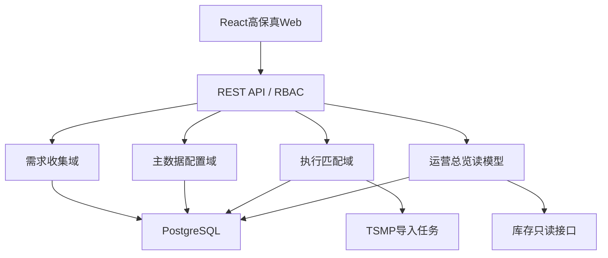
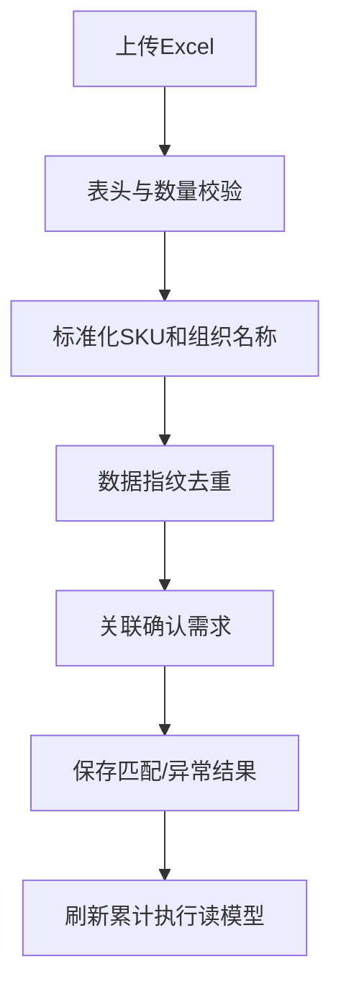

# MSS样机备货管理平台技术架构

## 1. 架构目标

在不改动当前高保真视觉与交互的前提下，把前端内存状态逐步替换为可审计、可并发控制、可接入TSMP的服务端能力。架构必须优先保证角色边界、业务状态机、主数据一致性和导入幂等性。

## 2. 推荐技术栈

| 层 | 生产推荐 | 当前基础代码 |
| --- | --- | --- |
| Web | React 19、Vite、TypeScript、React Router、TanStack Query、Zod | 现有React 19/Vite高保真；新增`src/api/client.js`契约客户端 |
| API | Node.js 22、Fastify、TypeScript、Zod/OpenAPI | Fastify领域路由与Zod输入校验已落地 |
| 数据库 | PostgreSQL 16 | SQLite用于零配置开发；同一迁移支持PostgreSQL |
| 异步任务 | Redis + BullMQ | 当前同步完成TSMP解析与幂等写入；大文件可演进为Worker |
| 文件 | 企业对象存储/OneBox兼容存储 | 正式排产Excel由反馈快照生成并返回下载 |
| 身份 | 企业SSO/OIDC | 当前为JWT账号登录；生产可替换为企业SSO签发JWT |
| 观测 | OpenTelemetry、结构化日志、指标告警 | 每个响应携带`requestId` |

## 3. 逻辑架构



## 4. 工程目录

```text
mss-sample-stocking-platform/
├── src/                         # 当前高保真Web
│   └── api/client.js            # REST客户端骨架
├── server/
│   └── src/                     # Fastify入口、领域服务、Repository与迁移
├── db/schema.sql                # PostgreSQL目标表结构
├── docs/
│   ├── MSS-sample-stocking-platform-PRD-v1.0.md
│   ├── TECHNICAL-ARCHITECTURE.md
│   ├── openapi.yaml
│   ├── TRACEABILITY-MATRIX.md
│   └── DOUBAO-VIBE-CODING-BRIEF.md
└── tests/api-v1.test.mjs        # 真实API集成测试
```

## 5. 领域边界

### 5.1 配置域

拥有产品领域、产品、SKU/BOM、区域—代表处—国家组织树和TSMP别名。业务表仅保存稳定ID及必要快照，不复制当前责任人姓名。

### 5.2 需求收集域

拥有收集计划、计划范围快照、区域草稿/提交、领域反馈快照和GTM导出。所有状态变更必须由领域服务完成，控制非法跳转。

### 5.3 执行匹配域

拥有TSMP导入任务、原始行、标准化值、匹配结果和累计执行事实。导入应采用“原始层→标准化层→匹配层→聚合读模型”四层处理，不直接覆盖历史累计值。

### 5.4 总览读模型

不拥有源数据，只按产品、SKU和组织维度聚合确认需求、排产、申请、发货与库存。总览与执行情况必须复用同一聚合服务。

## 6. 身份、RBAC与数据范围

请求通过`Authorization: Bearer <JWT>`解析`userId`和角色：

```http
Authorization: Bearer eyJ...
```

鉴权分两层：

1. 路由权限：角色是否允许调用该动作。
2. 数据范围：用户是否负责目标领域、区域或代表处。

配置读取可共享，配置写入首期按高保真允许GTM操作；正式上线建议将领域/组织配置写权限收敛到运营管理员，但不要新增高保真未体现的页面。

## 7. 状态与并发

- 业务状态在`shared/domain.mjs`定义稳定英文code，中文文案由前端映射。
- 更新请求携带`version`或`If-Match`；数据库使用`WHERE id=? AND version=?`更新。
- 状态更新、区域提交、领域反馈和审计日志必须在同一事务完成。
- 区域自动保存使用幂等PUT；正式提交和领域反馈使用幂等键，防止重复点击。

## 8. TSMP导入设计



生产实现建议：

- API只负责创建导入任务并返回`jobId`，Worker异步解析文件。
- 原始文件保留受控期限，原始行保存来源行号和指纹。
- 任何重试都按`jobId+fingerprint`幂等，不重复累计。
- 别名映射更新后只重跑未匹配行，不重导已成功记录。

## 9. 前端接入策略

当前页面保留高保真组件与CSS，业务读取和写入均通过`src/api/client.js`完成。`productData.js`仅保留为设计fixture，不参与运行时业务计算。

前端缓存Key建议：

```text
['catalog']
['collection-plans', role, domainId, regionId, keyword]
['collection-plan', planId]
['execution', productId, regionId, officeId, country, keyword]
['overview', productId]
```

## 10. 数据一致性

- 产品责任人通过`product.domain_id`实时关联领域，不在产品表重复保存。
- 计划范围下发时保存组织快照；配置变化不改写历史计划。
- 区域草稿与提交分开存储；确认需求只读取已提交且被领域反馈的快照。
- 总计由数据库或领域服务统一计算并返回，前端只做展示性校验。
- TSMP累计值来自匹配事实求和，不使用比例缩放模拟区域数据。

## 11. 错误码

| code | 场景 |
| --- | --- |
| `AUTH_REQUIRED` | 未登录或缺少身份 |
| `FORBIDDEN` | 角色或数据范围不允许 |
| `VALIDATION_ERROR` | 字段校验失败 |
| `PLAN_STATE_CONFLICT` | 当前状态不允许动作 |
| `VERSION_CONFLICT` | 并发版本冲突 |
| `REGIONS_INCOMPLETE` | 领域反馈时仍有区域未提交 |
| `IMPORT_HEADER_INVALID` | TSMP文件缺少必需列 |
| `IMPORT_DUPLICATE` | 文件或数据行已导入 |
| `MATCH_NOT_FOUND` | 无法匹配产品/组织/确认需求 |
| `NOT_FOUND` | 资源不存在 |

## 12. 测试策略

- 单元测试：状态机、汇总公式、TSMP指纹/匹配、角色权限。
- API测试：创建/下发计划、区域提交、领域反馈、配置无BOM产品、执行筛选。
- 集成测试：PostgreSQL事务、并发版本、导入幂等。
- E2E：四类角色完整业务流；逐屏比对高保真。
- 视觉回归：固定1363×936与1440×900截图，比较导航、KPI、表格、弹窗和底栏。

## 13. 本地运行

```bash
npm install
npm run dev
```

另开终端启动Fastify接口：

```bash
npm run dev:api:ts
```

接口健康检查：`GET http://localhost:8787/api/v1/healthz`。前端默认使用`http://localhost:8787/api/v1`。

## 14. 生产演进检查单

- [x] 使用Fastify TypeScript Repository与SQLite/PostgreSQL迁移。
- [x] 使用JWT替代请求头模拟角色，并实现领域/区域数据范围。
- [ ] 接入企业SSO并保留当前JWT载荷契约。
- [ ] TSMP导入改为对象存储+异步Worker。
- [ ] 接入真实库存只读服务与产品线排产数据。
- [ ] 增加审计查询、导出水印、数据保留和脱敏策略。
